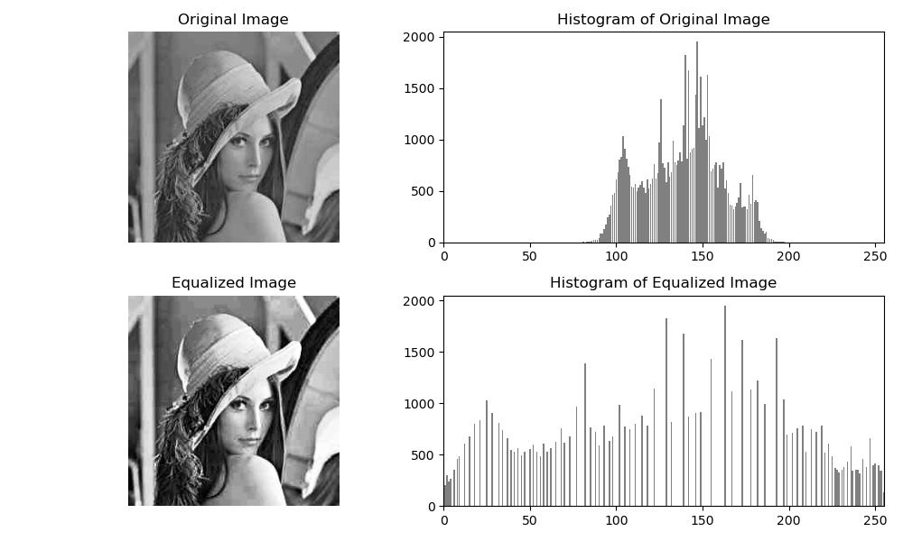
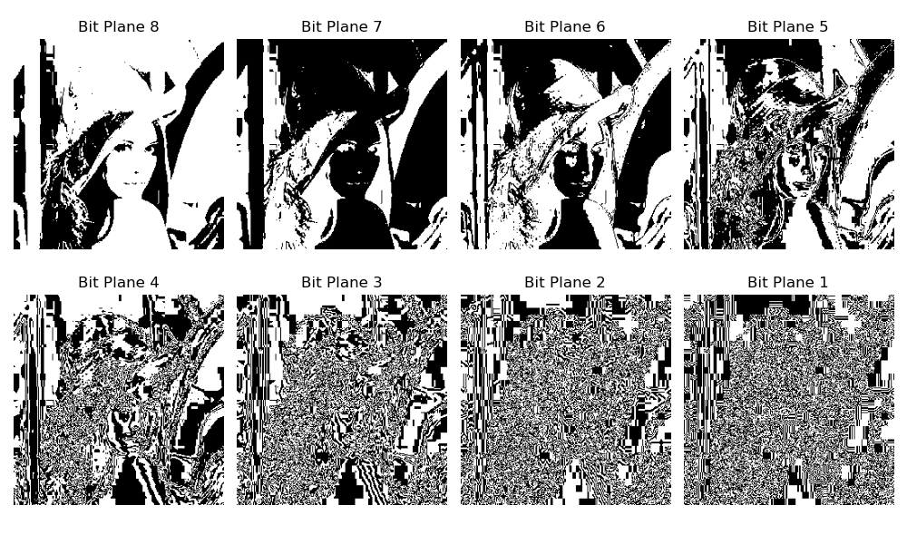

# 🧪 Digital Image Processing – Practical 2

This folder contains Python scripts and sample data for **Practical 2** of the Digital Image Processing Laboratory, part of the academic curriculum at IIIT Nagpur.

---

## 📌 Practical Overview

**Objective:**  
To perform image enhancement and binary decomposition techniques on a grayscale image, including:

- Histogram Equalization  
- Bit Plane Slicing

---

## 📂 Contents

| File Name                   | Description                                            |
|-----------------------------|--------------------------------------------------------|
| `Input_Image_Grayscale.jpg` | Sample grayscale input image for processing            |
| `vignesh_HistEqual.py`      | Python implementation of Histogram Equalization        |
| `vignesh_bitSlicing.py`     | Python implementation of Bit Plane Slicing             |
| `Output_HistEqu.png`        | Output showing histogram equalization result           |
| `Output_bitSlicing.png`     | Output showing all bit planes of the image             |
| `Output Images/`            |Folder containing resulting image outputs               |

---

## 🖼 Output Preview

### Histogram Equalization

---

### Bit Plane Slicing

---
